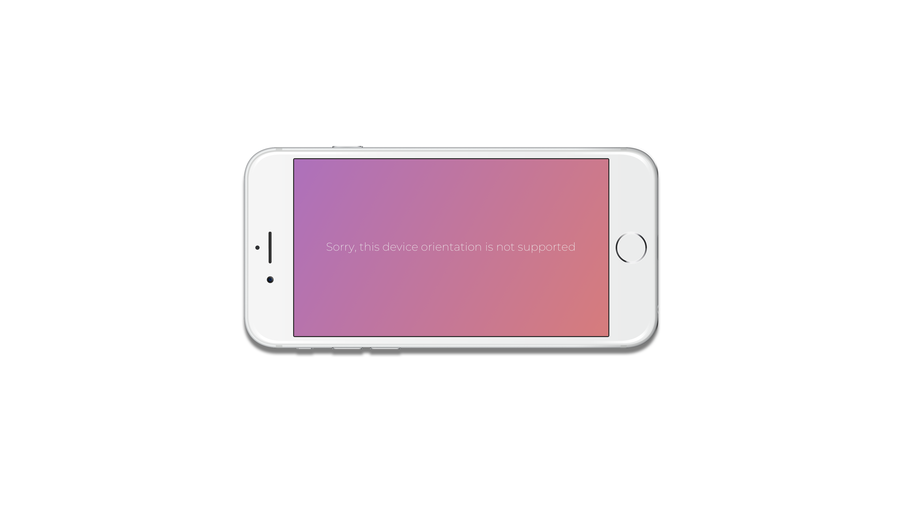

# prevent-orientation

Force orientation mode on mobile device

[](https://www.npmjs.com/package/prevent-orientation)
[](https://www.npmjs.com/package/prevent-orientation)



## Installation

```sh
$ yarn add prevent-orientation
```

or

```html
<script src="//unpkg.com/prevent-orientation"></script>
```

## Usage

```js
import PreventOrientation from 'prevent-orientation';

// force to portrait orienation
new PreventOrientation().forcePortrait();

// force to landscape orienation
new PreventOrientation().forceLandscape();
```

## Customize

```js
new PreventOrientation({
  text: 'Sorry, this device orientation is not supported',
  color: 'rgb(90, 90, 90)',
  background:
    'linear-gradient(to right, rgb(255, 175, 189), rgb(255, 195, 160))',
  fontSize: '1.2rem',
}).forceOrientationToAngle(0);
```

## License

MIT © [Nghiệp](http://nghiepit.pro)
